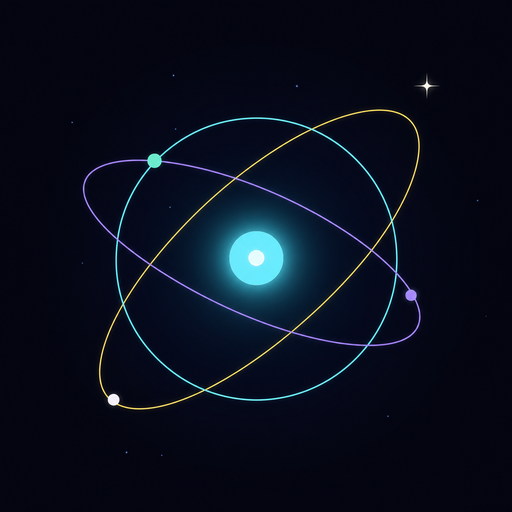

  
  
  

  <code>OBSERVATÓRIO</code> · <code>LABORATÓRIO</code> · <code>ARQUIVO CÓSMICO</code>

---

### `01 · PONTO DE OBSERVAÇÃO`

Sou **Matheus Camargo**, desenvolvedor full-stack interessado em sistemas que precisam continuar compreensíveis mesmo quando crescem.

Construo software como quem monta um observatório: defino instrumentos, separo sinal de ruído, conecto partes distantes e registro os limites do que cada solução consegue enxergar.

- `ENGENHARIA` — decomposição de problemas, arquitetura e evolução segura.
- `INTERFACE` — experiências claras, responsivas, acessíveis e interativas.
- `INVESTIGAÇÃO` — cosmologia, filosofia da ciência e visualização de ideias.
- `MÉTODO` — curiosidade alta, afirmações delimitadas e documentação honesta.

> **SINAL ATUAL** — transformando ideias complexas em sistemas navegáveis, tanto no código quanto no campo conceitual.

 

---

### `02 · INSTRUMENTOS`

  
  &nbsp;&nbsp;
  
  &nbsp;&nbsp;
  
  &nbsp;&nbsp;
  
  &nbsp;&nbsp;
  
  &nbsp;&nbsp;
  
  &nbsp;&nbsp;
  

  <code>JavaScript</code>
  &nbsp;·&nbsp;
  <code>React</code>
  &nbsp;·&nbsp;
  <code>Angular</code>
  &nbsp;·&nbsp;
  <code>Node.js</code>
  &nbsp;·&nbsp;
  <code>HTML/CSS</code>
  &nbsp;·&nbsp;
  <code>Git/GitHub</code>

<table>
  <tr>
    <td width="33%" valign="top">
      <strong>◉ SISTEMAS</strong> 
      Arquitetura, contratos, automação e código preparado para evoluir.
    </td>
    <td width="33%" valign="top">
      <strong>⌁ EXPERIÊNCIAS</strong> 
      Interfaces responsivas, interação visual e acessibilidade por padrão.
    </td>
    <td width="33%" valign="top">
      <strong>✦ CONHECIMENTO</strong> 
      Conteúdo estruturado, relações explícitas e documentação como parte do produto.
    </td>
  </tr>
</table>

---

### `03 · EM ÓRBITA AGORA`

<table>
  <tr>
    <td width="72%" valign="top">
      <h3>Observatório de Ideias</h3>
      

        Um sistema editorial e interativo para organizar hipóteses, referências,
        mapas conceituais, constelações, experimentos e rotas de aprendizagem.
      

      

        Construído com <strong>HTML semântico, CSS próprio, módulos JavaScript nativos
        e automações em Node.js</strong>, com atenção a acessibilidade, desempenho,
        conteúdo versionado e limites editoriais explícitos.
      

      

        <code>TEORIAS</code> · <code>MAPA</code> · <code>GRANDES NOMES</code> 
        <code>CONSTELAÇÕES</code> · <code>LABORATÓRIO</code> · <code>ROTAS GUIADAS</code>
      

      

        <a href="https://soulwatching.vercel.app/"><strong>Explorar o observatório ↗</strong></a>
        &nbsp;·&nbsp;
      

    </td>
    <td width="28%" align="center" valign="middle">
      
    </td>
  </tr>
</table>

---

### `04 · CANAL ABERTO`

Se o problema exige **clareza, arquitetura e uma solução não-trivial**, provavelmente já temos um bom ponto de partida.

  <a href="https://www.linkedin.com/in/gomin/">LinkedIn</a>
  &nbsp;·&nbsp;
  <a href="mailto:soulwatching@gmail.com">E-mail</a>
  &nbsp;·&nbsp;
  <a href="https://matheus14623.vercel.app">Observatório</a>

  ✦ perguntas difíceis · sistemas legíveis · café forte ✦

